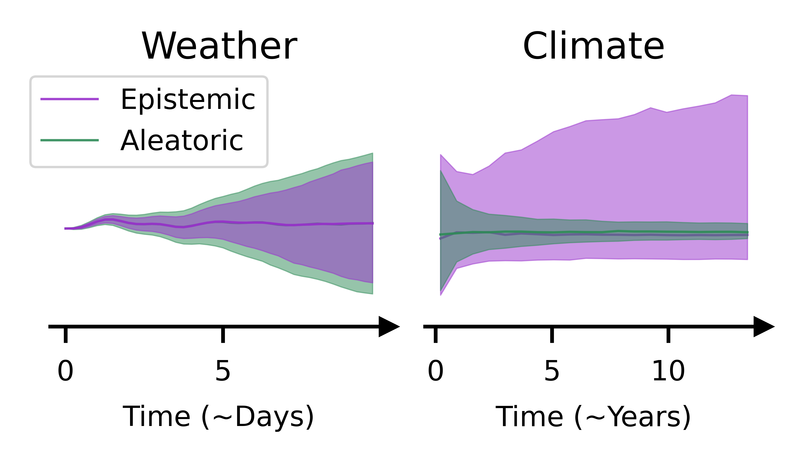

## Epistemic and Aleatoric Uncertainty in Weather and Climate Modelling

This is the repo for the code to explore epistemic and aleatoric uncertainty across timescales. 
We use the two layer Lorenz 1996 Model and learn a parameterisation for the small-scale variables.
We use a Bayesian neural network to separate uncertainties in epistemic (from the model parameters - weights, biases)
and aleatoric (from the subgrid variability in the training). Then we run this in an online setting to
compare how epistemic and aleatoric uncertainty evolve over weather and climate timescales.

### Summary 

Aleatoric and epistemic uncertainties over time on weather and climate timescales, estimated through ensembles that sample aleatoric and epistemic uncertainty using Bayesian neural networks for parameterisations in the Lorenz 1996 model. The spread shows the 16th and 84th percentiles. For weather, we show divergence of large-scale variables from the ensemble mean, where aleatoric uncertainty from subgrid v   ariability dominates. For climate, we show the ratio of time spent in one weather regime, where epistemic uncertainty is the dominant source of uncertainty.

### Project Directory Overview

**`L96/`**  
Core implementation of the Lorenz–96 dynamical system, including model equations and numerical integration methods.

**`ml_models/`**  
PyTorch and Pyro implementations of neural network and Bayesian neural network parameterisations.

**`scripts/`**  
Reusable functions for generating training data, training ML models, and running the L96 system coupled to parameterisations under different sampling methods.

**`experiments/`**  
High-level scripts used to execute full experiment pipelines: data generation, ML model training, and coupled model simulations.

**`plotting_scripts/`**  
Reusable plotting functions for analysis, including error trajectories, spread–skill plots, probability distribution functions, and animations.

**`create_plots/`**  
High-level scripts that generate the plots and visualisations used in analysis, papers, and presentations.

**`utils/`**  
General-purpose helper functions for metrics, probability scoring, file operations, data transformations, and plotting support.

**`tests/`**  
Unit tests validating the Lorenz–96 model components and associated utilities.

## Authors

Laura A. Mansfield (primary developer) and Hannah M. Christensen.

Email: laura.mansfield@physics.ac.uk

If you use this repository or build upon it, feel free to reach out or open an issue. Contributions and feedback are welcome.
